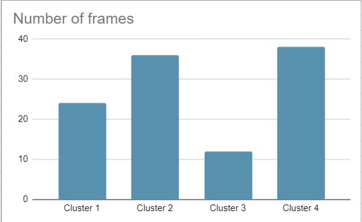

# E_LAN-NDVR
## Детекция дубликатов видео
Мы предлагаем наше решение в рамках Всероссийского хакатона Цифровой прорыв: Сезон ИИ для кейсодержателя Yappy. 
### Проблема, поставленная на кейсе
Новый видео контент на платформе Yappy может быть дубликатом уже существующего. Это приводит к ухудшению клиентского опыта и уменьшает охваты у создателей оригинального видео.
### Задача
Разработать микросервис на основе алгоритмов компьютерного зрения и машинного обучения для детекции видео дубликатов
### Решение
В рамках решения мы успели тщательно проверить несколько идей. <br />
#### Первое решение 
При реализации первого решения мы вдохновлялись этой [статьей](https://www.researchgate.net/publication/311990276_Near-Duplicate_Video_Retrieval_by_Aggregating_Intermediate_CNN_Layers). <br />
Идея состоит в том, что каждое видео проходит сначала покадровую обработку с помощью CNN модели. Обработка состоит в том, чтобы брать от каждого слоя свертки MaxPool по каждому каналу слоя. Например, если в слое 96 слоев, то в результате MaxPool'а по каналам мы получим вектор из 96 элементов. Далее все вектора, полученные таким образом, складываются в один вектор, представлющий из себя выжимку особенностей кадра. После этого все обработанные кадры всех тренировочных видео подаются в модель кластеризации. Для проверки гипотезы мы решили подать для кластеризации 200 видеороликов. Следующим шагом является получение вектора, описывающего видео. Каждый кадр проходит через кластеризацию и записывается в гистограмму, где по горизонтали ось количества всех кластеров, а по вертикали количество кадров, принадлежащих конкретному кластеру (Смотреть пример ниже на картинке). Далее для поиска дубликатов мы решили хранить вектора обработанных видео в векторной базе данных (Qdrant). Когда загружается новое видео, мы смотрим на самое ближайшее видео по сходству по косинусам и/или по расстоянию в эклидовом пространсте. <br /><br /> В рамках хакатоны мы успели проверить модели AlexNet и GoogLeNet. По нашим метрикам GoogLeNet показала себя с лучшей стороны <br /><br />
Однако к сожалению мы сделали выбор искать другой алгоритм решения нашей задачи так как этот не подходит к требованию масштабирования и самое главное не подходит по метрике на валидационных данных (F1 = 0.3)



#### Второе решение 
При реализации второго решения мы вдохновлялись этой [статьей](https://openaccess.thecvf.com/content_ICCV_2017_workshops/papers/w5/Kordopatis-Zilos_Near-Duplicate_Video_Retrieval_ICCV_2017_paper.pdf). <br />
Второе решение несет в себе схожую идею с первой в виде прогонки каждого кадра с MaxPool'ом через CNN модель. Но дальше идут различия. После обработки мы должны получить для каждого видео его дескриптор через усреднения всего тензора видео. Например после CNN модели у нас есть тензор размера (118x5481) где 118 - количество кадров. После усреднения мы получаем (1x5481) вектор, который является дескриптором видео. Далее наша задача составить тренировочный датасет для модели машинного обучения. Идея в том, чтобы сделать этот датасет, где каждый объект имеет форму (V, V+, V-), где V это оригинальное видео, V+ это его дубликат и V- это не дубликат оригинального. После этого мы обучаем DNN модель на этих триплетах, имея функцию потери вида <br /> L(vi, v+i, v−i) =max{0, D(fθ(vi), fθ(v+i)) − D(fθ(vi), fθ(v−i)) + γ} <br />, где D(.) - расстояние в эвклидовом пространстве, fθ(.) - наша DNN модель.
Далее, обученная DNN модель выдает нам вектор эмбеддинга одного видео. Этап с поиском дубликата видео крайне похож, если не одинаков с первым решением. При появлении нового видео мы ищем самый близкий вектор другого видео и решаем является ли дубликат на основе порогового значения. <br /><br />
В рамках конечного решения мы выбрали вторую реализацию
#### Преимущества выбранного решения
* Масштабируемость: Скорость обработки видео не зависит от количества видео в базе данных, а скорость поиска достигается за счет хранения эмбеддингов видео в векторной базе данных
* Скорость работы решения: В среднем обработка одного видео не превышает одной секунды (Не учитывается скачивание видеоролика)
* Сложные кейсы учитываются при обучении модели (V-)
Учет различных дубликатов также учитываются с помощью (V+)


---
## Как запускать решение

```

```

